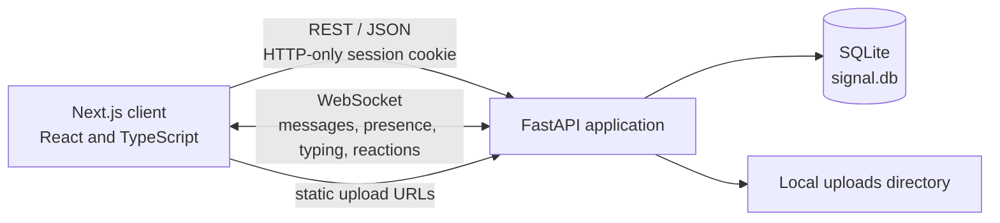
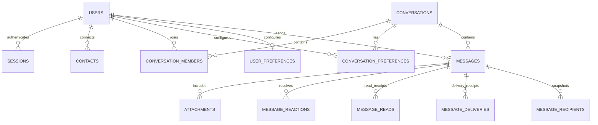

# Signal-Inspired Secure Chat

A local full-stack messaging app with a Signal-inspired interface. It combines a Next.js client, a FastAPI REST and WebSocket server, and a SQLite database. It is a learning/demo project and does not implement Signal's production end-to-end encryption or telephone verification.

## What the app supports

- **Accounts and sessions:** Register or log in with a phone number or username. Identifiers are unique without regard to letter case. The demo uses a fixed OTP, and login sessions use a hashed server-side token in an HTTP-only cookie that expires after 14 days.
- **Contacts and people search:** Add an existing account by identifier, search registered users, and view connected users. Adding an unknown identifier returns a user-not-found error.
- **Direct and group conversations:** Start or reuse a direct conversation, view seeded group conversations, and manage group members as the group creator/admin. The group creation API exists; the current new-group form does not yet submit to it.
- **Messaging:** Send and load persisted text messages, see delivery/read state, quote-reply to a message, and use live typing indicators. Messages are delivered to connected users over WebSockets and retained in SQLite.
- **Attachments:** Upload images, video, audio, and other files. Uploaded files are kept under `backend/uploads` and served by the API.
- **Reactions:** Add or remove emoji reactions. Reactions are persisted and broadcast to conversation members in real time.
- **Presence and unread state:** See online/last-seen presence and unread counts. Opening a conversation marks incoming messages read.
- **Chat organization:** Search conversations, filter by unread/favourites/groups, and save per-user favourite and archive preferences.
- **Preferences:** Select light, dark, or system appearance; edit the display name; persist read-receipt and in-app notification preferences; and choose a default disappearing-message duration for conversations created by the user.
- **Other interface features:** Responsive desktop/mobile layout, safety-number display, message search over the messages currently loaded in the chat, attachment/emoji menus, and call preview screens.

### Demo and implementation boundaries

- The OTP is always `123456`; no SMS or email is sent.
- The call screen is an interactive preview, not a WebRTC voice/video call. Status/stories are marked as coming soon.
- Safety numbers are illustrative values. Messages and files are **not end-to-end encrypted** by this project.
- In-app notifications are local UI toasts; there is no push notification service.
- The new-group form is currently a UI placeholder: it closes and refreshes but does not call the group-creation API. The backend endpoint is available for clients that call it directly.
- The disappearing-message menu in an open chat currently updates the displayed client state only. The saved default duration is applied by the API when creating new conversations.
- Uploaded files are served as static files, and the upload endpoint does not currently require a login. Treat this as local development software, not a production deployment.

## Technology stack and requirements

| Area | Technology |
| --- | --- |
| Frontend | Next.js 14, React 18, TypeScript |
| UI and icons | CSS, Lucide React |
| Backend | Python 3.10+, FastAPI, Uvicorn |
| Database | SQLite (included with Python) |
| Real-time transport | FastAPI WebSockets |
| File uploads | FastAPI `UploadFile`, `python-multipart`, local disk storage |

Install **Python 3.10 or newer**, **Node.js 18.17 or newer**, and npm. No separate database server is needed. Internet access is needed the first time dependencies are installed; the UI also loads Inter from Google Fonts and uses remote avatar URLs in the demo seed data.

## Run from a fresh checkout

By default, the frontend uses the API at `http://localhost:8000` and the WebSocket at `ws://localhost:8000`. These defaults support local development. For deployment, configure `NEXT_PUBLIC_API_URL` and `NEXT_PUBLIC_WS_URL` as described below.

### Windows quick start

From the project root, run:

```bat
run.bat
```

The script creates the backend virtual environment and installs dependencies if needed, installs frontend dependencies if `node_modules` is missing, starts both development servers, and opens the app at [http://localhost:3000](http://localhost:3000). Keep both opened terminal windows running.

### Manual setup

Open two terminals in the project root.

**Terminal 1 - backend (Windows PowerShell):**

```powershell
cd backend
py -m venv .venv
.\.venv\Scripts\Activate.ps1
python -m pip install -r requirements.txt
python -m uvicorn main:app --reload --port 8000
```

On macOS/Linux, create and activate the environment with `python3 -m venv .venv` and `source .venv/bin/activate`, then install the same requirements and run `python -m uvicorn main:app --reload --port 8000`.

**Terminal 2 — frontend:**

```sh
cd frontend
npm install
npm run dev
```

Open [http://localhost:3000](http://localhost:3000). The FastAPI interactive API reference is at [http://localhost:8000/docs](http://localhost:8000/docs).

On the first backend startup, the app creates `backend/signal.db`, applies schema migrations, and seeds demo accounts and conversations only if the database has no users. To reset local demo data, stop the backend and remove `backend/signal.db`; uploaded files are stored separately in `backend/uploads`.

## Try the demo

The initial seed includes these identifiers:

| Identifier | Demo display name |
| --- | --- |
| `+15550100` | Alex Morgan |
| `+15550101` | Sarah Connor |
| `+15550102` | Marcus Chen |
| `+15550103` | Elena Rostova |
| `+15550104` | David Kim |

Use OTP `123456`. Seed data is created only when the database starts empty. Alex is seeded with contacts and sample direct/group conversations. You can also register another account with any unused identifier and use the same demo OTP.

## Architecture overview



- **Frontend:** `frontend/app` contains the App Router page, styles, and React components. The page loads the current session, conversations, contacts and messages, then keeps the active chat synchronized over a WebSocket.
- **REST backend:** `backend/main.py` defines authentication, profile/preferences, contact, conversation, message, reaction, read-receipt, group-member, and upload routes.
- **Authentication:** `backend/auth.py` creates random session tokens, stores only their SHA-256 hashes, and checks expiry. The browser receives the raw token in an HTTP-only cookie.
- **Real time:** `backend/websocket_manager.py` tracks one or more sockets per user. WebSocket access is checked against the session cookie. The server broadcasts messages, message status/read updates, reactions, typing state, and presence.
- **Persistence:** `backend/database.py` creates and migrates the SQLite schema. `backend/seed.py` inserts sample users and chats when the database is empty.

## Database schema



| Table | Purpose |
| --- | --- |
| `users` | Unique account identifier, display name, avatar, status, presence, and demo safety number. |
| `sessions` | Hashed session token, user reference, creation time, and expiry. |
| `contacts` | User-to-user contact links. |
| `conversations` | Direct/group type, name/avatar, disappearing timer, and timestamps. |
| `conversation_members` | Membership and role (`admin` or `member`) for each conversation. |
| `conversation_preferences` | Per-user favourite and archived state for each conversation. |
| `user_preferences` | Read receipts, in-app notifications, and default disappearing timer. |
| `messages` | Message text, sender, reply reference, status, system-message flag, and expiry. |
| `attachments` | Local file URL/path, name, type, and size associated with a message. |
| `message_reactions` | Unique emoji reaction per message and user. |
| `message_reads` | Per-user read timestamps. |
| `message_deliveries` | Per-user delivery timestamps. |
| `message_recipients` | Recipient snapshot taken when each message is sent, so later membership changes do not rewrite its receipt audience. |

## API surface

All REST routes are under `/api` and most require a valid session cookie.

| Method and path | Purpose |
| --- | --- |
| `POST /auth/start`, `POST /auth/verify` | Begin login/registration and verify the demo OTP. |
| `GET /auth/me`, `POST /auth/logout` | Restore or end the current session. |
| `PATCH /users/profile`, `GET/PATCH /users/preferences` | Update profile and saved preferences. |
| `GET /users/search`, `GET /users/connected` | Search registered users and list connected users. |
| `GET /contacts`, `GET /contacts/search`, `POST /contacts` | List, search, or add contacts. |
| `GET /conversations`, `POST /conversations/direct`, `POST /conversations/group` | List conversations or create/reuse conversations. |
| `PATCH /conversations/{id}/preferences` | Save favourite/archive state. |
| `POST /conversations/{id}/disappearing` | Set the conversation timer through the API. |
| `POST /conversations/{id}/members`, `DELETE /conversations/{id}/members/{user_id}` | Add or remove group members (admin only). |
| `GET/POST /conversations/{id}/messages` | Load or send messages. |
| `POST /messages/{id}/reactions` | Toggle an emoji reaction. |
| `POST /conversations/{id}/read` | Record read receipts. |
| `POST /upload` | Upload a file and return its URL. |

The WebSocket endpoint is `/ws/{user_id}`. It authenticates using the same session cookie; relevant events include `new_message`, `message_status`, `messages_read`, `typing_status`, `reaction_update`, and `user_presence`.

## Deployment configuration

The frontend reads public API settings at build time. Copy `frontend/.env.example` to `frontend/.env.local` for local overrides, or set these variables in the frontend hosting provider before building:

| Variable | Example | Purpose |
| --- | --- | --- |
| `NEXT_PUBLIC_API_URL` | `https://secure-chat-system.onrender.com` | Backend origin; do not append `/api`. |
| `NEXT_PUBLIC_WS_URL` | `wss://secure-chat-system.onrender.com/ws` | WebSocket base; keep the `/ws` path. |

The WebSocket URL defaults from the API URL when omitted, converting `https` to `wss` (and `http` to `ws`) and adding `/ws`.

Set these backend environment variables in the backend hosting provider. `backend/.env.example` lists the production values for the Render domains in this project:

| Variable | Example | Purpose |
| --- | --- | --- |
| `FRONTEND_ORIGINS` | `https://secure-chat-system-frontend.onrender.com` | Comma-separated browser frontend origins allowed by CORS. Do not include the backend URL. Localhost origins are also allowed. |
| `PUBLIC_API_URL` | `https://secure-chat-system.onrender.com` | Public backend origin used to build attachment URLs. |
| `COOKIE_SECURE` | `true` | Sends the HTTP-only session cookie only over HTTPS. Set this to `true` in production. |
| `COOKIE_SAMESITE` | `none` | Allows the cookie on cross-site frontend-to-backend requests. `none` requires `COOKIE_SECURE=true`. |

All authenticated REST calls use `credentials: "include"`; the WebSocket uses the browser's session cookie. The backend CORS middleware allows credentials and the configured frontend origin. Set both frontend and backend URLs to your actual deployed hosts if they differ from the examples. The frontend variables are public values and must not contain secrets.

Deploy the backend with persistent storage mounted for `backend/signal.db` and `backend/uploads` if account data and uploaded files must survive redeploys. The current SQLite database and local upload directory are single-instance storage; this project does not configure a managed database or object store.

## Configuration and assumptions

- Local API and WebSocket defaults are `http://localhost:8000` and `ws://localhost:8000/ws`; deployment overrides use the variables above.
- The HTTP-only session cookie is insecure and `SameSite=Lax` by default for local HTTP. Production should explicitly set `COOKIE_SECURE=true` and `COOKIE_SAMESITE=none` when frontend and backend are hosted on separate sites.
- The fixed OTP, demo safety-number display, local file storage, and lack of end-to-end encryption are deliberate demo assumptions, not production security guarantees.
- SQLite and the in-memory WebSocket connection manager suit a single local server process. Multiple backend workers or distributed deployment would require shared persistence/broadcast infrastructure.
- The seed loader skips all sample data if any user already exists; it does not partially seed a populated database.

## Main project files

```text
backend/
  auth.py                 Session creation and authentication
  database.py             SQLite schema, migrations, connections
  main.py                 FastAPI routes and WebSocket endpoint
  models.py               Pydantic request models
  seed.py                 Initial demo data
  websocket_manager.py    Per-user WebSocket connections
  uploads/                Uploaded files
frontend/
  app/page.tsx            Main application state and layout
  app/components/         Chat, navigation, contacts, auth, and modals
  app/styles.css          Application themes and component styles
  app/landing.css         Landing page styles
run.bat                   Windows local development launcher
```
