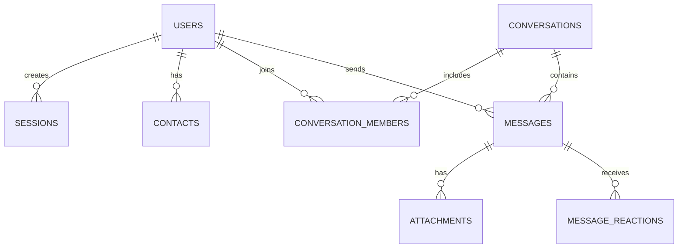

# Secure Messaging Platform (Signal Messenger Clone)

A full-stack, real-time clone of the **Signal Messenger** application built according to the Scaler SDE Fullstack Assignment specifications. Recreates Signal's design system, privacy-focused UX, and real-time messaging workflows.

---

## 🛠️ Technical Stack

- **Frontend**: [Next.js](https://next.js.org/) (TypeScript, React 18, Custom Signal Vanilla CSS Design System, Lucide Icons)
- **Backend**: [FastAPI](https://fastapi.tiangolo.com/) (Python 3.10+, Uvicorn)
- **Database**: [SQLite](https://www.sqlite.org/) (`signal.db`) with standard relational schema
- **Real-time Engine**: WebSockets via FastAPI `WebSocket` manager & `ws` protocol

---

## 🚀 Quick Start & Installation

### 1. Automated One-Click Launcher (Windows)

Simply run the included batch script:

```bat
run.bat
```

This will automatically set up the Python virtual environment, install backend & frontend dependencies, seed the SQLite database, and launch both services:
- **Backend API**: `http://localhost:8000`
- **Frontend App**: `http://localhost:3000`

---

### 2. Manual Setup

#### Backend Setup:

```powershell
cd backend
python -m venv .venv
.\.venv\Scripts\Activate.ps1
pip install -r requirements.txt
python main.py
# Or launch directly with uvicorn:
uvicorn main:app --reload --port 8000
```

#### Frontend Setup:

```powershell
cd frontend
npm install
npm run dev
```

Open `http://localhost:3000` in your browser.

---

## 🔑 Demo Account & Authentication

- **Phone Number / Username**: Enter any phone number (e.g. `+15550100`) or username.
- **Demo Verification Code (Fixed OTP)**: `123456`
- Pre-seeded test accounts:
  1. `+15550100` — **Alex Morgan** (Demo Account)
  2. `+15550101` — **Sarah Connor**
  3. `+15550102` — **Marcus Chen**
  4. `+15550103` — **Elena Rostova**
  5. `+15550104` — **David Kim**

---

## ✨ Features Implemented

### 1. Authentication & Onboarding
- Mocked phone number / username login and registration flow
- Fixed OTP verification (`123456`) with display name setup
- HTTP-Only cookie-based session management with 14-day persistence

### 2. Contacts & Conversation List
- Signal layout with collapsible left-hand list & main chat pane
- Search chats & contacts with keyboard shortcut support (`Ctrl+K`)
- Filter tabs: **All**, **Unread**, **Groups**, **Direct**
- Unread message counters & real-time online/offline presence indicators
- Add new contacts by phone number or username

### 3. One-on-One Messaging
- Real-time direct messaging powered by WebSockets
- Message status indicators: Sent (✓), Delivered (✓✓), Read (✓✓ in green)
- Live typing indicators ("... is typing")
- Message history persisted in SQLite database

### 4. Group Messaging
- Create groups with name, avatar, and multi-contact selection
- Real-time group broadcasts to all active members
- Group info modal displaying member list, admin roles, and metadata

### 5. Signal Privacy & UI Experience
- Pixel-perfect Signal Dark and Light themes toggleable from settings
- Signal 60-digit Safety Number verification modal with QR code generator
- Disappearing messages timer (Off, 5s, 30s, 1m, 1h, 1d) with automatic countdown badges

### 6. Interactive Placeholders & Bonus Features
- **File & Image Attachments**: Instant file upload API and media rendering
- **Emoji Reactions**: Hover reaction bar (❤️, 👍, 😂, 😮, 🔥) synced live via WebSockets
- **Quoted Replies**: Threaded reply snippets attached to message bubbles
- **Signal HD Voice & Video Call Screen**: Interactive call preview modal with mute, video toggle, and call duration timer

---

## 🗄️ Database Schema

The database relies on an optimized relational SQLite schema defined in `database.py`:



### Key Tables:
1. `users`: Stores user credentials, display name, avatar, online status, and 60-digit Signal safety number.
2. `sessions`: Hashed session tokens with expiry timestamps.
3. `contacts`: Foreign key pairing connecting users to added contacts.
4. `conversations`: Stores conversation metadata (`direct` vs `group`), group name, group avatar, and disappearing message timer.
5. `conversation_members`: Junction table mapping users to conversations with roles (`admin`, `member`).
6. `messages`: Stores content, sender ID, status (`sending`, `sent`, `delivered`, `read`), reply references, system message flags, and expiry timestamps.
7. `attachments`: Files associated with messages (image, video, file).
8. `message_reactions`: Emoji reactions per message per user.

---

## 🔌 API & WebSocket Documentation

### REST Endpoints

- `POST /api/auth/start` — Check if identifier exists or requires registration
- `POST /api/auth/verify` — Verify demo OTP (`123456`) and set HTTP-only session cookie
- `GET /api/auth/me` — Fetch currently authenticated user
- `POST /api/auth/logout` — Revoke active session
- `GET /api/contacts` — List all contacts for logged-in user
- `POST /api/contacts` — Add new contact by identifier
- `GET /api/conversations` — Retrieve all active 1-on-1 and group conversations
- `POST /api/conversations/direct` — Create or retrieve direct conversation
- `POST /api/conversations/group` — Create new group conversation
- `POST /api/conversations/{conv_id}/disappearing` — Update disappearing message timer
- `GET /api/conversations/{conv_id}/messages` — Fetch message history
- `POST /api/conversations/{conv_id}/messages` — Send message and trigger WebSocket broadcast
- `POST /api/messages/{msg_id}/reactions` — Toggle emoji reaction
- `POST /api/conversations/{conv_id}/read` — Mark conversation messages as read
- `POST /api/upload` — Upload file attachment

### WebSocket Real-time Channel

- **Endpoint**: `ws://localhost:8000/ws/{user_id}`
- **Events Broadcasted**:
  - `new_message`: Pushed to all conversation members when a message is sent
  - `typing_status`: Notifies members when a user is typing
  - `reaction_update`: Real-time emoji reaction sync
  - `user_presence`: Online / last seen updates when sockets connect/disconnect
  - `messages_read`: Read receipt checkmark updates
